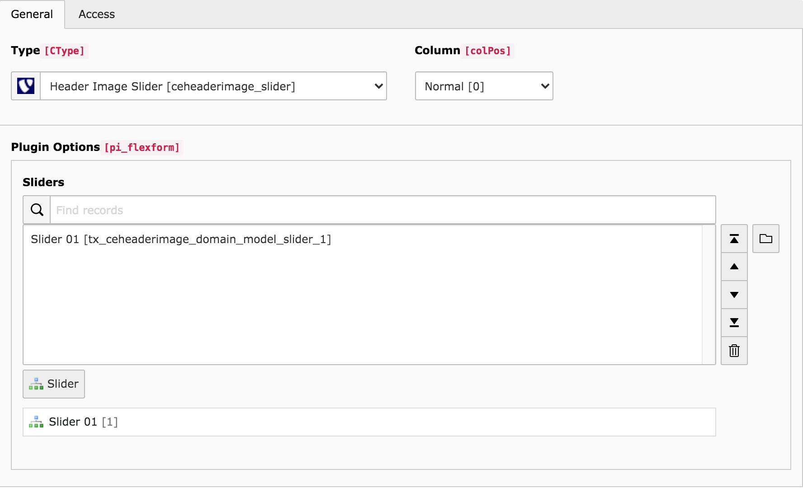

.. include:: ../Includes.txt

.. _introduction:

============
Introduction
============

.. _what-it-does:

What does it do?
================

This extension provides a plugin that renders multiple slider entities.
The slider entity allows you to define a image, title, description and, link.

Screenshots
===========

Backend view of the plugin

Backend view of the entity
